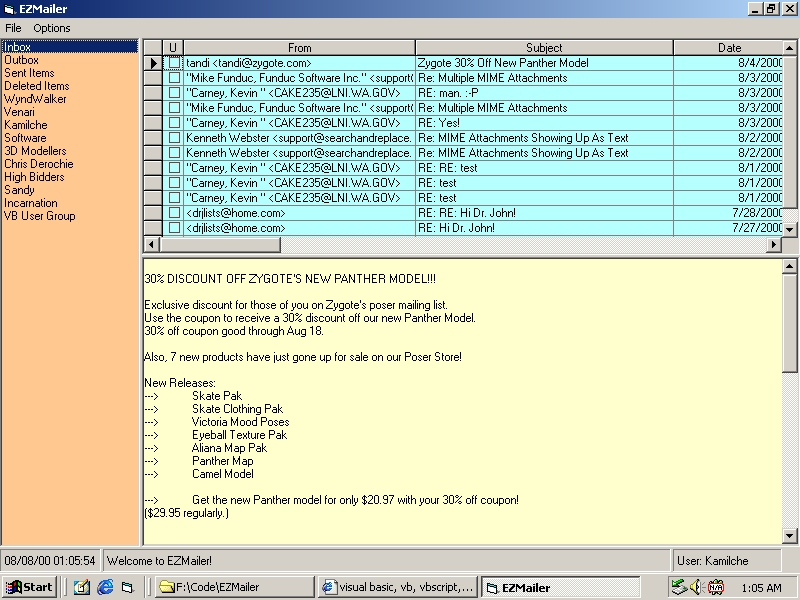



## EZMailer, an SMTP/POP3 email program

### Description

Are you tired of Outlook and Outlook Express hanging your machine, and letting the KAK virus in? Well, I am too, so in response, I made EZMailer, a simple email program that sends and receives mail, PERIOD. It doesn't attempt to interpret or auto-execute ANYthing, thus sparing you from the vagaries of security loopholes in 'advanced' mail programs. This program receives incoming mail from a POP3 server, sends outgoing mail through an SMTP server, handles MIME attachments, multiple users, and automatically routes incoming mail to folders based on criteria you specify. Note that to successfully execute this code in the runtime environment, you must own Apex Software's TrueDBGrid Pro, www.apexsc.com; and Funduc's Encode/Decode DLL, www.funduc.com
 
### More Info
 

             |
---                |---
**Submitted On**   |2000-08-08 01:03:50
**By**             |[Kamilche](https://github.com/Planet-Source-Code/PSCIndex/blob/master/ByAuthor/kamilche.md)
**Level**          |Intermediate
**User Rating**    |3.3 (39 globes from 12 users)
**Compatibility**  |VB 5\.0, VB 6\.0
**Category**       |[Complete Applications](https://github.com/Planet-Source-Code/PSCIndex/blob/master/ByCategory/complete-applications__1-27.md)
**World**          |[Visual Basic](https://github.com/Planet-Source-Code/PSCIndex/blob/master/ByWorld/visual-basic.md)
**Archive File**   |[CODE\_UPLOAD8725882000\.zip](https://github.com/Planet-Source-Code/kamilche-ezmailer-an-smtp-pop3-email-program__1-10505/archive/master.zip)

